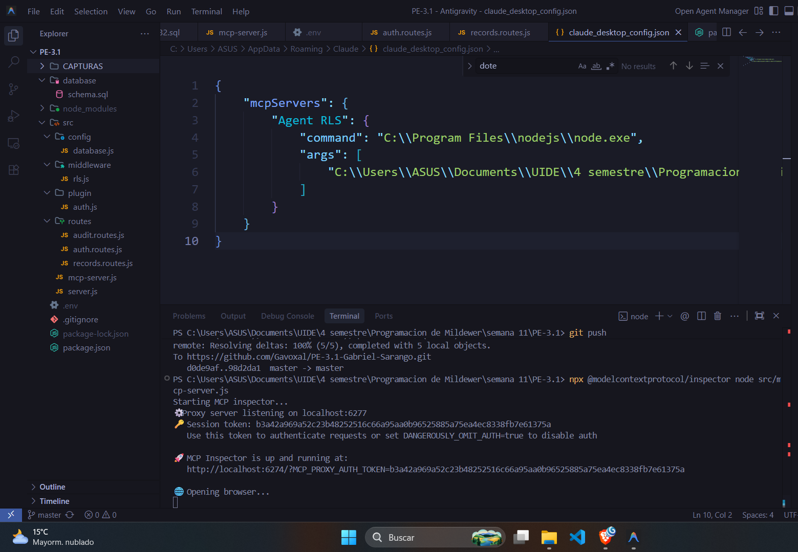

# Implementación Utilizando MCP (Model Context Protocol)

Este documento registra el proceso realizado hoy sobre la implementación y ejecución del servidor MCP en el proyecto PE-3.1.

## Descripción General

Se ha trabajado en la configuración y puesta en marcha de un servidor utilizando el SDK de `@modelcontextprotocol/sdk`. El archivo principal del servidor se encuentra en `src/mcp-server.js`.

El objetivo ha sido integrar las capacidades del protocolo MCP para permitir la interacción estandarizada con el contexto del modelo.

## Capturas del Proceso

A continuación se presentan las capturas de pantalla que documentan el proceso de ejecución y pruebas, ubicadas en la carpeta `CAPTURAS`.

### Evidencia 1

### Evidencia 2

### Evidencia 3

### Evidencia 4

### Evidencia 5

